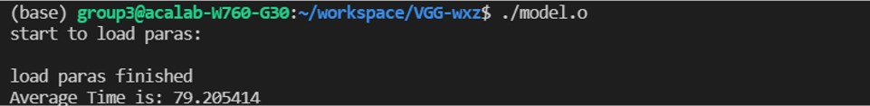
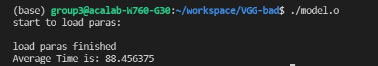

### VGG 模型(CUDA实现)
-------
* 文件说明
  * model/:模型参数预处理  
  * paras.json:模型各层类型，参数。
  * vgg16_main.cu:模型主函数，负责读取数据，初始化，调用推理函数，对比正确性
  * model.hpp:模型定义，初始化，推理
  * layers.cuh:定义具体层(kernel function)操作
  * utils.h:一些帮助函数
  * json.hpp:c++ 读取json库, [原仓库链接](https://github.com/nlohmann/json)
  * Makefile:
    * make: 编译
    * make clean: 清除输出文件
* 代码架构:
  * 通过传如传入模型参数以及权重参文件路径,构造VGG16类,初始化模型。
  * 调用类函数VGG16::inference(float*,float*)进行推理,传出输出。
* 优化:
  - [x] 并行方式:
    * 卷积层: 并行粒度为每个thread计算每张特征图上的一个点，每个block计算一张特征图
    * 池化层: 并行粒度为每个thread计算每张输出特征图上的一个点
  - [x] ，每个block计算输出的一个二维矩阵
    * 全连接层: 并行粒度为每个thread计算每张输出矩阵上的一个点
  - [x]  共享内存: 
    * 在卷积中，每个卷积核对应一张特征图，并且被一个block计算，所以说可以先将卷积核加载到共享内存中，然后在每个block中thread对其进行取用。
  - [x]  寄存器优化:
    * 在每个函数当中使用寄存器加快访问速度
  - [x] 集成relu到各个层当中
  - [ ] 减小线程数量: 在每个线程进行多个计算，减小overhead。 
* 步骤
  - [x] 模型解析, 
  - [x] 模型读取
  - [x] 模型编写-cuda
  - [x] 测试正确性
  - [x] 优化

* 代码效果:
  * 最终版本:
  
  * 无shared_memory
  
  
